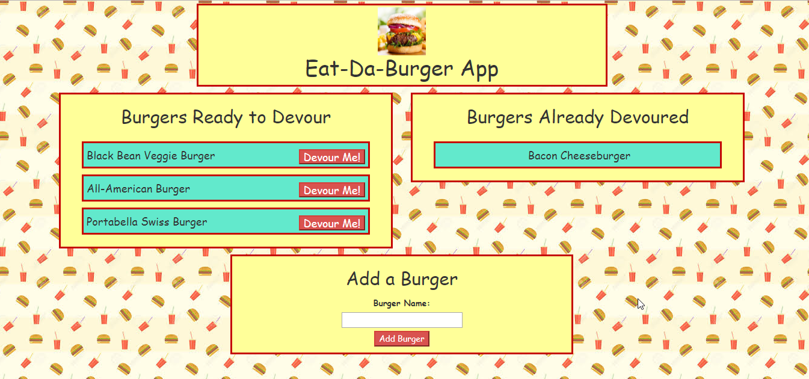

# burger

Node Express Handlebars

Rhonda Johnson

## Overview

Eat-Da_Burger is restaurant app that lets users input the names of burgers they would like to eat.  Users then can select when a burger is devoured.

The burger logger uses MySQL, Node, Express, Handlebars, and a homemade ORM.  The app follows the MVC design ptter.  Node and MySQL are to query and route data in the app.  Handlebars is used to generate the HTML. 

# Link to deployed project
https://burger199.herokuapp.com/

# Links to GitHub
https://github.com/rmxjohnson/burger.git

https://rmxjohnson.github.io/burger/

# Built with:
 * Node.js
 * MySQL
 * Handlebars
 * body-parser NPM Package
 * express NPM Package
 * mysql NPM Package
 * handlebars NPM Package
 * express-handlebars NPM Package

## Home Page

